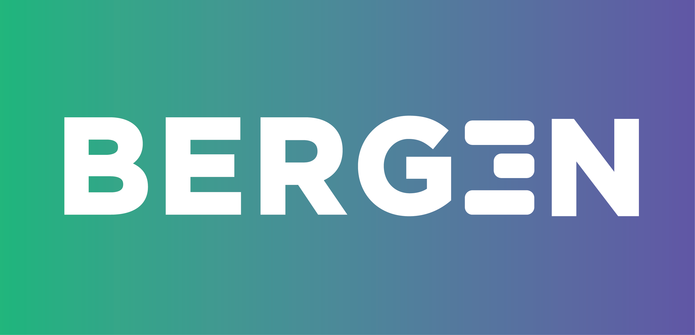
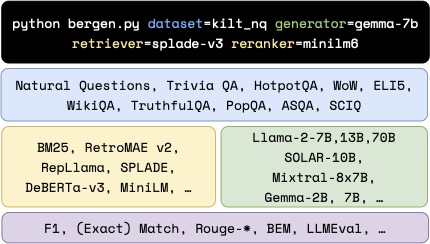

# BERGEN: A Benchmarking Library for Retrieval-Augmented Generation
 
[](https://arxiv.org/abs/2407.01102)
[](https://arxiv.org/abs/2407.01463)
[](https://creativecommons.org/licenses/by-nc-sa/4.0/)

BERGEN (BEnchmarking Retrieval-augmented GENeration) is a library designed to benchmark RAG systems with a focus on question-answering (QA). It addresses the challenge of inconsistent benchmarking in comparing approaches and understanding the impact of each component in a RAG pipeline.

## Key Features

- Easy reproducibility and integration of new datasets and models
- Support for various retrievers (20+), rerankers(4) and large language models (20+)
- Flexible configuration system using YAML files
- Comprehensive evaluation metrics (*Match, EM, LLMEval*, ... )
- Support for multilingual experiments

 

For more information and experimental findings, please see:
- The initial BERGEN paper: https://arxiv.org/abs/2407.01102 and our [EMNLP'24 slides](documentation/BERGEN.pdf)
- The Multilingual RAG paper: https://arxiv.org/abs/2407.01463

## Quick Start

A typical RAG setup follows this pipeline:

`question` >> `retriever` >> `reranker` >> `LLM` >> `answer`

You can configure each component using simple YAML files. Here's an example of running an experiment:

```bash
python3 bergen.py retriever="bm25" reranker="minilm6" generator='tinyllama-chat' dataset='kilt_nq'
```

## Installation

Check the [installation guide](documentation/INSTALL.md) for detailed instructions.


## Usage

```
# simple setup for benchmarking
# run the retriever and cache results
# do the generation with VLLM
for dataset in kilt_nq kilt_hotpotqa kilt_triviaqa asqa popqa ; do
   
   python3 bergen.py  retriever=splade-v3 reranker=debertav3  dataset=$dataset
    
   python3 bergen.py  retriever=splade-v3 reranker=debertav3 dataset=$dataset  generator=vllm_SOLAR-107B
done
```


To fully configure BERGEN, please read our [configuration guide](documentation/config.md)

## Evaluation

Run the evaluation script to calculate LLMEval metrics and print the results:

```bash
python3 evaluate.py --experiments_folder experiments/ --llm_batch_size 16 --split 'dev' --llm vllm_SOLAR-107B

#parse all the experiments files into a panda dataframe
python print_results.py --folder experiments/ --format=tiny
```

Bergen also offers the possiblity to run pairwise comparisons using an LLM as judge. For more evaluation options and details, refer to the [Evaluation section](documentation/evaluations.md) in the complete documentation.

## RAG Baselines
Bergen provides results for several models and many datasets aiming to **provide strong baselines**. On the important datasets for RAG, the match metric is given by this table (see more in our paper): 
### Match Metric
 Model | ASQA | NQ | TriviaQA | POPQA | HotPotQA|
:----------:|:----------:|:----------:|:----------:|:----------:|:----------:
Llama-2-7B  | 68.4 | 61.6 | 87.9 | 60.2 |  45.9|
Llama-2-70B | 73.2 | 65.8 | 92.3 | 65.5  | 53.6|
Mistral-8x7B| 73.5 | 67.1 | 91.8 | 67.9 |  54.5|
Solar-10.7B   | 76.2 | 70.2 | 92.8 | 71.2 |  53.9|


## Multilingual Experiments

Refer to our [multilingual RAG guide](documentation/multilingual.md) for running experiments with multilingual user queries and/or multilingual Wikipedia as a datastore.


## Training

To train a model, add a training config:

```bash
python3 bergen.py retriever="bm25" reranker="minilm6" generator='tinyllama-chat' dataset='kilt_nq' train='lora'
```

## Extensions

To add new datasets and models, or configure prompts, see our [reference guide](/extensions.md).


## Cite

If you use BERGEN for your research, please consider citing:

```bibtex
@misc{rau2024bergenbenchmarkinglibraryretrievalaugmented,
      title={BERGEN: A Benchmarking Library for Retrieval-Augmented Generation}, 
      author={David Rau and Hervé Déjean and Nadezhda Chirkova and Thibault Formal and
      Shuai Wang and Vassilina Nikoulina and Stéphane Clinchant},
      year={2024},
      eprint={2407.01102},
      archivePrefix={arXiv},
      primaryClass={cs.CL},
      url={https://arxiv.org/abs/2407.01102}, 
}

@misc{chirkova2024retrievalaugmentedgenerationmultilingualsettings,
      title={Retrieval-augmented generation in multilingual settings}, 
      author={Nadezhda Chirkova and David Rau and Hervé Déjean and Thibault Formal and Stéphane Clinchant and Vassilina Nikoulina},
      year={2024},
      eprint={2407.01463},
      archivePrefix={arXiv},
      primaryClass={cs.CL},
      url={https://arxiv.org/abs/2407.01463}, 
}
```

## License

BERGEN is released under the Creative Commons Attribution-NonCommercial-ShareAlike 4.0 license. For more details, see the [LICENSE](LICENSE) file.

---
